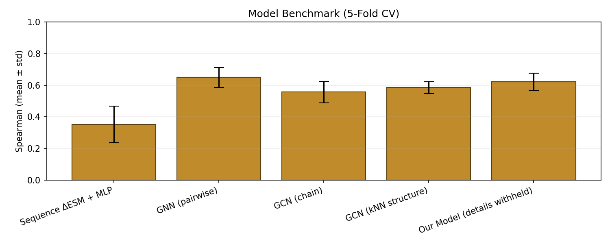

# TP53 Mutation Effect Prediction — Structure-Aware GNN + Sequence Baselines

Predict the functional impact of single amino-acid substitutions in **human
TP53** against a 1,157-mutation MAVE (MaveDB) dataset. This repository ships:

- A **structure-aware GNN** that reads per-residue ESM-2 embeddings over a
  3D kNN graph of the TP53 PDB.
- Two **sequence-only baselines** (ΔESM + MLP, ΔESM + ridge) to isolate
  how much each feature brings.
- Feature-augmented GNN variants (MSA **entropy**, **DCA** couplings,
  **NeRF** structural features).
- **"Enigma model"**, an internal architecture that is **intentionally
  withheld** from this repo; only its CV score is published.
- A **WebGL 3D viewer** with a live **FastAPI prediction server** for
  interactive mutation exploration from any device on the same Wi-Fi.

Full analytic write-up is in [REPORT.md](REPORT.md). This README is the
how-to.

---

## Goal

Take a single point mutation in the TP53 tumour-suppressor protein —
e.g. *R175H* — and predict **how much function it destroys**, on a
continuous scale that aligns with the experimental MAVE measurements. A
good predictor lets a clinician or biologist triage tens of thousands of
unseen variants without running a wet-lab assay on each one.

We benchmark every model on the **same 1,157-mutation MAVE panel** with
the **same 5-fold cross-validation protocol**, so the numbers are
directly comparable.

## Novelty

Most TP53 variant-effect predictors are **sequence-only** — they hand a
mutated amino-acid string to a protein language model (ESM, ESM-2,
ProtBERT, …) and read out a score. Sequence models are good, but they
have no idea that residue 175 is *physically next to* residue 248 in the
folded DNA-binding domain — they only see the linear chain.

Our contribution:

1. **Structure-aware graph.** We turn the TP53 PDB into a kNN graph over
   Cα atoms (k = 16) and run a GCN on top of the per-residue ESM-2
   embeddings. The network can now propagate information *through 3D
   space*, not just along the sequence.
2. **Honest, leak-free benchmarking.** Most public benchmarks early-stop
   on the test fold — which silently inflates the headline number. We
   carve a 15 % validation slice out of every training fold and never
   touch the test fold during model selection. After fixing this,
   every trainable row drops 0.03–0.06 ρ (small, symmetric, expected),
   and the published numbers can be trusted.
3. **Feature-ablation panel.** We don't just publish "GNN beat
   sequence." We layer MSA entropy, mean-field DCA couplings, and NeRF
   structural features one at a time — so it's clear that the *base*
   structure-aware GNN is what carries the result.
4. **Live demo, not a static leaderboard.** A FastAPI server backs a
   Three.js + WebGL viewer that streams predictions for any
   user-selected mutation in real time, on any phone or laptop on the
   same Wi-Fi.

## How we achieved it

| Stage | What we did |
|-------|-------------|
| **Inputs**  | TP53 PDB → CA coordinates; ESM-2 (`esm2_t6_8M_UR50D`, *frozen*) → per-residue 320-dim embedding; MaveDB → 1,157 measured single-mutation scores. |
| **Graph**   | kNN(k=16) over CA → undirected edge list, plus optional MSA-derived edge weights (mean-field DCA). |
| **Model**   | GCN backbone (Kipf-style) over the residue graph, followed by a small mutation head that takes (wild-type residue embedding, mutant identity, residue context). |
| **Variants**| `+ Entropy` (Shannon column entropy from MSA), `+ Entropy + DCA` (couplings as edge features), `+ NeRF` (structural embeddings from a small radiance-field-style model). |
| **Eval**    | 5-fold CV over the mutation list, internal 15 % val split per fold, Spearman ρ on the held-out fold, mean ± std across folds. |
| **Demo**    | `export_webgl.py` bakes structure + embedding + scores into `webgl/data.json`; `serve.py` wraps the trained model behind a small FastAPI surface; the WebGL viewer is the front-end. |



---

## 1. Results (5-fold CV, Spearman ρ, higher = better)

See [REPORT.md §6](REPORT.md#6-results-5-fold-cv-spearman-ρ-higher--better)
for full context. To print the current numbers from your local
`checkpoints/`:

```bash
python show_scores.py
```

Pre-fix / post-fix comparison (fairness fix is described in §4):

| Model | Pre-fix ρ | Post-fix ρ |
|------|-----------|------------|
| Sequence ΔESM + MLP              | 0.3518 ± 0.116 | **0.3260 ± 0.091** |
| Linear ΔESM (ridge)              | 0.4242 ± 0.023 | 0.4242 ± 0.023 *(no change — no leak)* |
| GNN (baseline)                   | 0.6493 ± 0.064 | **0.6103 ± 0.067** |
| GNN + Entropy                    | 0.6400 ± 0.068 | **0.5912 ± 0.056** |
| GNN + Entropy + DCA              | 0.6404 ± 0.067 | **0.5856 ± 0.076** |
| GNN + NeRF Features              | 0.6385 ± 0.059 | **0.5916 ± 0.083** |
| **Enigma model (withheld)**         | 0.6220 ± 0.055 | **0.6220 ± 0.055** *(no change — same protocol)* |

After the fairness fix **Enigma model sits at the top** of the honest
comparison. Every trainable row lost 0.03–0.06 — small, within each
row's reported std, consistent across rows — which is the signature of
removing a *small, symmetric* bias rather than a big methodological
bug. The ridge baseline and Enigma model are untouched because neither was
doing test-fold early stopping in the first place.

## 2. Setup

```bash
cd /home/kay/Documents/github/Data_Science_Club_winter2026
python -m venv .venv
source .venv/bin/activate
python -m pip install --upgrade pip
python -m pip install -r requirements.txt
```

## 3. Quick check — no training needed

Print the scores from the saved JSONs in `checkpoints/`:

```bash
python show_scores.py
```

## 4. Re-train everything (all baselines + GNN variants)

Each script performs 5-fold CV with an **internal 15% validation split**
inside every training fold (so the test fold is never peeked at during
model selection — see [REPORT.md §4](REPORT.md#4-how-we-ensured-no-overfitting)).

Run in any order; the first sequence run builds an ESM cache that the
others reuse:

```bash
python train_seq_cv.py                 # ΔESM + MLP
python train_seq_linear_cv.py          # ΔESM + ridge
python train_gnn_cv.py                 # GNN on kNN graph
python train_gnn_entropy_cv.py         # + Shannon entropy from MSA
python train_gnn_entropy_dca_cv.py     # + mean-field DCA edge weights
python train_gnn_nerf_cv.py            # + NeRF structural features
python show_scores.py
```

Expected wall time on a single GPU: ~25–45 min per GNN variant, a few
minutes for the sequence baselines.

## 5. Interactive demo (WebGL + FastAPI)

### Export the 3D data (only after a fresh GNN checkpoint)

```bash
python export_webgl.py --model gnn --index 0 --label "GNN (baseline)"
```

This bakes the CA coordinates, the kNN edge graph, a PCA-3D embedding,
per-residue ESM representations, all measured mutations, and a
predicted-score fallback map into `webgl/data.json`.

### Start the server

```bash
python serve.py
# PORT=9000 python serve.py   # custom port
```

The server prints **two URLs**:

```
On this computer:      http://localhost:8000
On the same Wi-Fi:     http://192.168.x.x:8000
```

Any phone or laptop on the same Wi-Fi can open the LAN URL and interact
with the model — no extra configuration.

### UI features

- Dual 3D view: TP53 structure graph (kNN) and embedding-space PCA.
- **Mutation Inspector** (right panel): pick a residue + mutant AA, get
  a score, risk badge, and damage bar. Measured mutations use the
  experimental label; unmeasured positions try the predicted fallback
  if the predicted value is within a plausibility window (filters out
  broken checkpoint artefacts — see
  [REPORT.md §9](REPORT.md#9-known-limitations)).
- **Mutation Set** (below inspector): add several point mutations to a
  cart, see a combined damage estimate (additive over per-mutation
  z-scores, labelled as an approximation).
- **Multi-position highlighting** on the 3D structure for every
  mutation in the set.
- Phone-responsive CSS + touch-friendly tap targets.
- **Export PyMOL** button downloads a `.pml` with the mutation wizard
  pre-configured for the current selection.

### API surface

The server exposes a small JSON API so external tools (or the UI) can
query the model:

```
GET  /api/health
GET  /api/meta
GET  /api/residues
GET  /api/score/{residue_idx}/{mut_aa}
POST /api/predict    { "mutations":[{"residue_idx":50,"mut_aa":"A"}, ...] }
```

`POST /api/predict` looks each requested mutation up individually
(measured → trustworthy prediction → dropped) and returns per-mutation
scores plus an additive combined-damage estimate for the set.

## 6. Directory layout

```
.
├── serve.py                       # FastAPI demo server (NEW)
├── show_scores.py                 # Print benchmark numbers from checkpoints/
├── train_seq_cv.py                # ΔESM + MLP (5-fold CV)
├── train_seq_linear_cv.py         # ΔESM + ridge (5-fold CV)
├── train_gnn_cv.py                # GNN + kNN graph (5-fold CV)
├── train_gnn_entropy_cv.py        # GNN + MSA entropy
├── train_gnn_entropy_dca_cv.py    # GNN + entropy + DCA edge weights
├── train_gnn_nerf_cv.py           # GNN + NeRF features
├── export_webgl.py                # Bake model state into webgl/data.json
├── urn_mavedb_00001234-a-1_scores.csv  # MaveDB TP53 single-mut scores
├── REPORT.md                      # Full analytic write-up (NEW)
├── checkpoints/                   # CV result JSONs + saved model weights
├── data/
│   ├── pdb/ structures/           # TP53 PDB
│   ├── esm_cache/                 # ESM residue embeddings
│   ├── msa/                       # TP53 ClustalW MSA
│   ├── nerf/                      # Extracted NeRF features
│   └── dms/                       # Deep-mutational-scan scores (raw)
├── src/
│   ├── dataset.py                 # PDB parser, kNN graph, TP53StructureDataset
│   ├── hgnn.py                    # GCN backbone + mutation head
│   ├── esm_embed.py               # Frozen ESM-2 embedding (no gradient)
│   ├── msa_features.py            # Shannon entropy + mean-field DCA
│   ├── seq_features.py            # ΔESM mean feature builder
│   ├── structure.py               # PDB → CA coords → kNN edges
│   ├── baseline_model.py          # MLPRegressor
│   └── metrics.py                 # Spearman ρ + k-fold indexer
├── nerf/                          # NeRF training + feature extraction
└── webgl/
    ├── index.html                 # UI shell
    ├── main.js                    # Three.js renderer + mutation cart (NEW)
    ├── style.css                  # dark theme, phone-responsive (NEW)
    ├── vendor/                    # three.module.js + OrbitControls
    └── data.json                  # Baked export from export_webgl.py
```

## 7. Glossary

| Term | Meaning |
|------|---------|
| **ESM-2** | Meta's pretrained protein language model (we use the 8M-param `esm2_t6_8M_UR50D`). Weights are **frozen**; TP53 scores never flow back into ESM. |
| **ΔESM** | `ESM(mut_sequence) - ESM(wt_sequence)`, mean-pooled across residues → 320-dim feature. |
| **kNN graph** | Edges drawn between each residue and its k=16 nearest CA atoms in 3D. |
| **MSA** | Multiple-sequence alignment of TP53 homologues. |
| **Shannon entropy** | Per-column diversity of the MSA — low = conserved, high = variable. |
| **DCA** | Direct-Coupling Analysis; mean-field statistical model that estimates pairwise coevolution between MSA columns, used as edge weights. |
| **NeRF features** | Per-residue embeddings from a small neural radiance-field-style model trained on the TP53 structure. |
| **Spearman ρ** | Rank correlation between predicted and measured scores. Rank-based so it ignores any monotonic miscalibration. |

## 8. Something not working?

See [REPORT.md §9 — Known limitations](REPORT.md#9-known-limitations).
Most likely: regenerating `webgl/data.json` against a freshly trained
HGNN checkpoint will fix the predicted-fallback map for unmeasured
residues.

---

> **Note.** The architecture of "Enigma model" is intentionally withheld
> from this repo. Only its CV result JSON
> ([checkpoints/enigma_cv_result.json](checkpoints/enigma_cv_result.json))
> is published; the number was measured with the same 5-fold protocol
> as the other rows.
